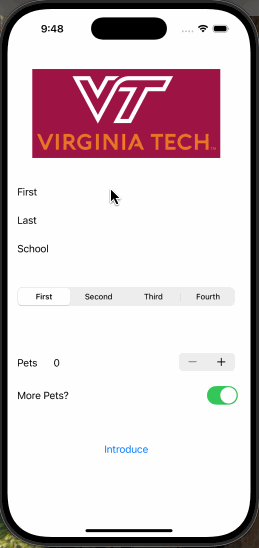

## IntroduceStudent

### App Description

`This is an iOS app that is meant to introduce the student. It has different fields that accept the user details as inputs. It has multiple types of inputs such as text boxes, a segmented control bar, a stepper, and a switch. When the button is pressed it formats the inputs into a well structured introduction and outputs it into an alert box.`

### App Walk-though

 

### Required Features

- [x] 1. App displays an image of a school's logo
- [x] 2. App has three textfields for first, last, and school names
- [x] 3. App has a segmented control that changes student year
- [x] 4. Number of pet matches label is increased/decreased by stepper
- [x] 5. Switch makes a statement about wanting more pets or not(true/false) 
- [x] 6. Introduce yourself button shows alert box with an introduction and dismiss button

### Optional Features

- [ ] 1. User can tap a button to change the color of the background view
- [ ] 3. User can select on additional buttons that provide more info about the user. Example: more textfields, a different alert box, etc.
- [ ] 4. Any stylistic changes that are not default options (Comment this here)
